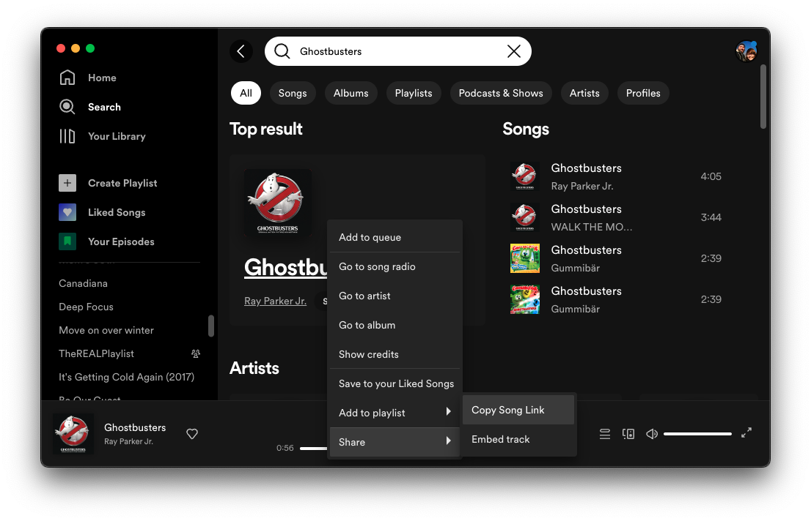

# MixTape
Tape deck-like interface for Spotify using Arduino MKR 1010 and Adafruit PN532 NFC Breakout Board

## Introduction 

My kids are really into music. They like playing it, singing it, dancing to it, and making it up on their own. But they are only 4, so they are too young to go onto our Spotify account and find the music they want to play for themselves. When I was growing up, you would find your favourite tape or CD by the cover and just pop it into the player. That visual-tactile element of music is missing in digital players.

The [Arduino MKR WiFi 1010](https://docs.arduino.cc/hardware/mkr-wifi-1010) and [Adafruit PN532 Breakout Board](https://www.adafruit.com/product/364) give us a way back to that. The MKR WiFi 1010 is Internet-connected and the PN532 unlocks the power of NFC to store information on tags that can be turned into anything. In this tutorial we will turn those two pieces of electronic hardware into a tactile interactive music controller that feels a little like using your favourite tape deck. When we're done, the NFC tags will hold song, artist, album, or playlist information and tapping them on the NFC reader will trigger Spotify to play that item.

>If you need help setting up your environment to use your Arduino MKR WiFi 1010 board, please refer to [the setup guide here](https://docs.arduino.cc/hardware/mkr-wifi-1010).
>For setup instructions for the PN532, see [the breakout and shield guide here](https://learn.adafruit.com/adafruit-pn532-rfid-nfc).

## Goals

The goals of this project are:

- Connect to a Wi-Fi network.
- Configure the Spotify Web API
- Read and Write NFC tags
- Trigger the Spotify Web API using NFC tags

## Hardware & Software Needed

### Hardware
- MRK WiFi 1010
    - This general technique should work with other web-enabled boards, but this tutorial is tested specifically with the MKR WiFi 1010
- PN532 Breakout Board
- Breadboard (solderless, for prototyping)
- Jumper wires
### Software
- Arduino IDE 2.0
- Libraries installed:
    - [WiFiNINA](https://www.arduino.cc/en/Reference/WiFiNINA)
    - [Adafruit_PN532](https://github.com/adafruit/Adafruit-PN532/)
    - [ArduinoJSON](https://github.com/bblanchon/ArduinoJson)
    - [WiFiWebServer](https://github.com/khoih-prog/WiFiWebServer)
    - [SpotifyArduino](https://github.com/witnessmenow/spotify-api-arduino)
    - 
All of the libraries except SpotifyArduino can be installed using the Library Manager in Arduino 2.0. SpotifyArduino must be installed as a .zip library (Download the .zip archive from the [github repository](https://github.com/witnessmenow/spotify-api-arduino) and install using `Sketch > Include Library > Add .ZIP Library`)

### Circuit


The MKR WiFi 1010 and PN532 NFC Breakout are connected using the SPI interface. Both boards operate on 3.3V so there is no need to use a level shifter as shown in the [PN532 tutorial](https://learn.adafruit.com/adafruit-pn532-rfid-nfc). The wiring is as follows:
| MKR 1010 Pin | PN532 Pin   | Description                                                                                                            |
|--------------|-------------|------------------------------------------------------------------------------------------------------------------------|
| VCC          | 3.3V        | regulated 3.3v supply                                                                                                  |
| GND          | GND         | ground                                                                                                                 |
| ~3           | SSEL/SCL/RX | chip select (a.k.a. CS)                                                                                                |
| 8 MOSI       | MOSI/SDA/TX | [PICO (Peripheral In/Controller Out)](https://www.sparkfun.com/spi_signal_names) signal                                |
| 9 SCK        | SCK         | clock signal                                                                                                           |
| 10 MISO      | MISO        | [POCI (Peripheral Out/Controller In)](https://www.oshwa.org/2020/06/29/a-resolution-to-redefine-spi-pin-names/) signal |
> Please make sure your PN532 Breakout is in SPI mode with the jumpers set to `SEL0 = OFF, SEL1 = ON1`.

## Setting up the Spotify Web API
This project has two sketches attached to it: [getRefreshToken](getRefreshToken) and [MixTape](MixTape). The first, [getRefreshToken](getRefreshToken) is to help set up the [Spotify Web API](https://developer.spotify.com/documentation/web-api).

A full tutorial for using the `spotify-api-arduino` library is available [here](https://github.com/witnessmenow/spotify-api-arduino), but these instructions should get you started for this project. To get started, you need to register your app in the Spotify Developer system and then get a refresh token that will allow your sketches to interact with Spotify.
### Spotify Developer Account
* Sign into the [Spotify Developer page](https://developer.spotify.com/)
* Create a new application
* From `Dashboard > [YOUR APPLICATION NAME] > Settings` copy the `Client ID` and `Client secret`


### Getting Your Refresh Token
> The code for getRefreshToken is based heavily on the example code in the [spotify-api-arduino library](https://github.com/witnessmenow/spotify-api-arduino/).
> It is important for getting MixTape to work, but peripheral to the project itself, so there's no detailed explanation of the code here.
> For further details see the [original example sketch](https://github.com/witnessmenow/spotify-api-arduino/blob/main/examples/getRefreshToken/getRefreshToken.ino).

Now we need to add that information along with your WiFi connection information to the [getRefreshToken](getRefreshToken) sketch. Open getRefreshToken.ino and create a new tab called `secrets.h`. 

```cpp
// Use this file to store all of the private credentials
// and connection details

#define   SECRET_SSID   "WIFI_NETWORK" // replace MySSID with your WiFi network name
#define   SECRET_PASS   "WIFI_PASSWORD" // replace MyPassword with your WiFi password

#define   SECRET_CLIENT_ID   "Spotify Client ID" // Your client ID of your spotify APP
#define   SECRET_CLIENT_SECRET   "Spotify Client secret" // Your client Secret of your spotify APP (Do Not share this!)

#define   SPOTIFY_REFRESH_TOKEN   "" // Leave this blank for now. You'll get this in the next step.
```

Verify and Upload the getRefreshToken sketch to your MKR WiFi 1010. The serial monitor should show:
```
Connected to WIFI_NETWORK
IP address: xxx.xxx.xxx.xxx
HTTP server started
```

Note the IP address (it will likely be something local like `192.168.1.x` if you are on a home network with basic settings). Open a web browser to that address.


You should land on a page like the one above. That page is being served from your MKR WiFi 1010 and the link contacts the Spotify Servers to authorise the app and get a refresh token that you will use in other scripts. Before you do that, you need to set the correct website and redirect URI for your app in the Spotify Developer settings.


Now, click the `spotify Auth` button on the web page served by your MKR WiFi 1010. The page that appears should show a long string. That is your `SPOTIFY_REFRESH_TOKEN`. Paste that into your `secrets.h` file so your app can access the Spotify Web API.
## Preparing MixTape.ino
Now that your `secrets.h` file in  [getRefreshToken](getRefreshToken) is completed, you should add that same secrets file to the main MixTape.ino sketch. In the Arduino IDE, go to `Sketch > Add File` and select the `secrets.h` file from the `getRefreshToken` sketch directory.

`MixTape.ino` is divided into 5 files (tabs):
* `MixTape.ino` holds the main setup code and loop logic.
* `nfc.h` holds code related to reading and writing NFC tags
* `spotify.h` is where the functions to connect to Spotify and trigger playlist changes are found
* `defined.h` has important definitions and imports that would clutter the main .ino file
* `secrets.h` has private login and token information that shouldn't be uploaded to public repositories

All of the code for MixTape.ino is already in the file, but we'll go through the code step-by-step here so you understand how it all works.

## Writing an NFC tag
First we have to set up the PN532 Breakout Board. We import the necessary libraries (Wire, SPI, and Adafruit_PN532), define the SPI pins and declare the `nfc` object. We also instantiate a boolean variable, `nfcPresent` that we use to track whether an NFC tag has been read already so that we don't read the same tag over and over again.

```cpp
#include <Wire.h>
#include <SPI.h>
#include <Adafruit_PN532.h>

// Define the pins for SPI communication with the PN532
#define PN532_SCK  (9)
#define PN532_MOSI (8)
#define PN532_SS   (3)
#define PN532_MISO (10)

// Create the PN532 object using an SPI connection
Adafruit_PN532 nfc(PN532_SCK, PN532_MISO, PN532_MOSI, PN532_SS);

// Boolean variable to track the presence of a tag to avoid multiple reads
bool nfcPresent = false;
```

Three are three key functions that are used to handle NFC tags: `authNFC`, `writeSpotifyCode`, and `readSpotifyCode`.

`authNFC()` attempts to authenticate an NFC tag if one is present and returns the status of the authentication. It is used by both `writeSpotifyCode` and `readSpotifyCode`. It can be used in blocking mode (`blocking=true`) to stop all other execution until a tag is found or not blocking mode (where the read function is given a timeout of 100 ms) to check for a tag and return `false` if none is found.
> **NOTE** `blocking=false` is not technically speaking 'non-blocking'. It blocks for the length of the timeout which is set to 100 ms. The PN532 can be used in true non-blocking mode using I2C and interrupts, but that's not necessary for this project.

```cpp
bool authNFC(bool blocking){
  // Variables to store the results of a card read
  uint8_t success;
  uint8_t uid[] = { 0, 0, 0, 0, 0, 0, 0 };  // Buffer to store the returned UID
  uint8_t uidLength;                        // Length of the UID (4 or 7 bytes depending on ISO14443A card type)
  
  // Set variables to block or use a timeout
  int timeout = 100;
  if(blocking){
    nfcPresent = false;
    timeout = 0;
  }
  
  // Read a card
  success = nfc.readPassiveTargetID(PN532_MIFARE_ISO14443A, uid, &uidLength, timeout);
  
  // Update card presence and return false if necessary
  if(!success){ // Unsuccessful read. Return false and reset presence.
    nfcPresent = false;
    return false;
  } else if( nfcPresent && success ){ // Successful read, but for already read card.
    return false;
  }

  // Set presence to true
  nfcPresent = true;

  // Display some basic information about the card
  Serial.println("Found an ISO14443A card");
  Serial.print("  UID Length: ");Serial.print(uidLength, DEC);Serial.println(" bytes");
  Serial.print("  UID Value: ");
  nfc.PrintHex(uid, uidLength);
  Serial.println("");

  if (uidLength == 4) // Only use Mifare Classic cards. Untested on Mifare Ultralite
  {
    // Now we need to try to authenticate it for read/write access
    // Try with the factory default KeyA: 0xFF 0xFF 0xFF 0xFF 0xFF 0xFF
    Serial.println("Trying to authenticate block 4 with default KEYA value");
    uint8_t keya[6] = { 0xFF, 0xFF, 0xFF, 0xFF, 0xFF, 0xFF };

    // Start with block 4 (the first block of sector 1) since sector 0
    // contains the manufacturer data and it's probably better just
    // to leave it alone unless you know what you're doing
    success = nfc.mifareclassic_AuthenticateBlock(uid, uidLength, 4, 0, keya);

    if (success)
      return true;
  } else {
    Serial.println("Seems like you have the wrong type of card for this example. Please try a Mifare Classic card (4 byte UID)");
  }

  return false;
}
```
Now that we can authenticate NFC tags, we can start to write Spotify URIs to them. [Spotify URIs](https://developer.spotify.com/documentation/web-api/concepts/spotify-uris-ids) are in the form `spotify:TYPE:UUID`.
You can find a track ID (or the IDs for an artist/album/playlist) by right clicking on the track and selecting `Share > Copy Song Link`.
Open that link in a web browser and the track ID is the first portion of the URL after `/track/` and before the `?`. The Spotify URI for the Ghostbusters theme, then, is `spotify:track:3m0y8qLoznUYi73SUBP8GI`.



In the `nfcLoop()` function, there's a bit of code that runs when `Serial.available` is not `0`:

```cpp
String spotifyURI = Serial.readString();// Should be a spotify URI e.g. "spotify:track:3cRmHMdcalueasgmweHd2r"
spotifyURI.trim();
Serial.println(spotifyURI);
writeSpotifyCode(spotifyURI);
```
This tells the MKR WiFi 1010 to read a Spotify URI string from the Serial input and write it to an NFC tag using `writeSpotifyCode()`. If you have Uploaded MixTape to your Arduino, you can try writing an NFC tag now by pasting the Ghostbusters theme song's URI into the Serial Monitor's input box and pressing enter to send it to the Arduino. Then, place an NFC tag on the breakout board (it performs a blocking read, so it waits for a tag) to write to the tag.

## Reading an NFC tag
Now that you've written a tag, you can try reading it back through the NFC breakout. Remove the tag from the breakout and place it back again, and you will trigger the `readSpotifyCode()` function.
`readSpotifyCode()` checks for the presence of a tag, authenticates using `authNFC()` and then reads blocks 4-6 (the ones we wrote before) of the authenticated tag to retrieve the URI.
It cleans the URI and reconstructs it from the 16-byte arrays, and then returns that URI as a String.

```cpp
String readSpotifyCode(){
  String track = "";
  if(authNFC(false)){
    uint8_t data[16];

    for(int i=0; i < 3; i++){
      // Try to read the contents of block 4+i
      //TODO: Do something with success variable.
      uint8_t success = nfc.mifareclassic_ReadDataBlock(4+i, data);

      if (success)
      {
        // Data seems to have been read ... spit it out
        Serial.print("Reading Block ");
        Serial.print(4+i);
        Serial.println(":");
        nfc.PrintHexChar(data, 16);
        Serial.println("");

        track += (char *)data;
        track.trim(); // Get rid of some trailing characters
        // Check if last character should be removed
        if(track.charAt(track.length()-1) > 127){

          track = track.substring(0,track.length()-1);
        }
      }
      else
      {
        Serial.println("Ooops ... unable to read the requested block.  Try another key?");
      }
    }

    int newline = track.indexOf('\n');
    if(newline > 0){
      track = track.substring(0, newline);
    }

    Serial.print("Track to play: ");
    Serial.println(track);
  }
  return track;
}
```

Two functions bring this all together: `nfcSetup()` and `nfcLoop()`.
These functions are called from the main `setup()` and `loop()` functions in `MixTape.ino` and they make sure that the NFC hardware is correctly configured and running.

The loop function checks for Serial input to write to a tag. If there is no serial input, it checks if there is a tag to read.
If a tag is successfully read, it calls the `play()` function that is defined in `spotify.h` which we'll cover in the next section.

```cpp
void nfcSetup(){
  nfc.begin();

  // Check connection to the NFC board.
  uint32_t versiondata = nfc.getFirmwareVersion();
  if (! versiondata) {
    Serial.print("Didn't find PN53x board");
    while (1); // halt
  }
  // Got ok data, print it out!
  Serial.print("Found chip PN5"); Serial.println((versiondata>>24) & 0xFF, HEX);
  Serial.print("Firmware ver. "); Serial.print((versiondata>>16) & 0xFF, DEC);
  Serial.print('.'); Serial.println((versiondata>>8) & 0xFF, DEC);
}

void nfcLoop(){
  if (Serial.available() == 0){
    String uri = readSpotifyCode();
    if(uri.length() > 0){
      play(uri);
    }
  } else {
    String spotifyURI = Serial.readString();// Should be a spotify URI e.g. "spotify:track:3cRmHMdcalueasgmweHd2r"
    spotifyURI.trim();
    Serial.println(spotifyURI);
    writeSpotifyCode(spotifyURI);
  }
}
```

## Triggering a Song/Artist/Album/Playlist

Much of the `spotify.h` file is similar to what is found in the getRefreshToken.ino sketch and the [spotify-api-arduino](https://github.com/witnessmenow/spotify-api-arduino/)'s [playAdvanced.ino](https://github.com/witnessmenow/spotify-api-arduino/blob/main/examples/playAdvanced/playAdvanced.ino) example so we won't cover it line-by-line here.

The most important new function is the `play()` function, which takes a Spotify URI as a String and plays that object using Spotify's API. `play` takes a String and determines whether that string represents a `track` or another type of object (`playlist`,`album`, etc.). Tracks are sent to Spotify's Web API using the JSON body `{"uris": ["TRACK_URI_1", ...]}` whereas other objects are sent using `{"context_uri" : "OTHER_URI"}`.

The `play` function correctly forms that JSON parameter and then passes it to the `spotify.playAdvanced()` function. The `play` function is called from `nfcLoop` when a tag is read and a URI is returned to the loop and is responsible for actually interfacing with the Spotify Web API.

```cpp
void play(String uri){

    char body[100];
    
    if(uri.substring(8,13).equals("track")){
      sprintf(body, "{\"uris\" : [\"%s\"]}", uri.c_str());
    } else {
      sprintf(body, "{\"context_uri\" : \"%s\"}", uri.c_str());
    }

    if (spotify.playAdvanced(body))
    {
        Serial.print("Playing: ");
        Serial.println(uri);
    }
}
```

It is worth mentioning the `spotifySetup` function. Like `nfcSetup`, `spotifySetup` is called from the main `setup()` function in MixTape.ino. Because the Spotify API requires Internet access, `spotifySetup` ensures that the MKR WiFi 1010 is connected to the Internet, in addition to establishing the Spotify connection.

## Tying it all together
We have now covered all of the essential functionality in the `nfc.h` and `spotify.h` files. The main sketch file, `MixTape.ino`, unites all of this functionality in the main `setup` and `loop` functions.

`setup()` initialises the Serial connection, used across the sketch and then calls `nfcSetup` and `soptifySetup`. Similarly, `loop` calls on both `nfcLoop` and `spotifyLoop`, the latter of which is empty, but exists in case some continually-running functionality is needed involving the Spotify API at a later date.


```cpp
#include "defines.h"
#include "spotify.h"
#include "nfc.h"

void setup() {
  pinMode(LED_BUILTIN, OUTPUT);
  digitalWrite(LED_BUILTIN, HIGH);

  // Start the Serial connection
  Serial.begin(115200);
  while (!Serial) delay(10);

  delay(1000);
  digitalWrite(LED_BUILTIN, LOW);

  nfcSetup();
  spotifySetup();

  digitalWrite(LED_BUILTIN, HIGH);
}

void loop() {
  // put your main code here, to run repeatedly:
  nfcLoop();
  spotifyLoop();
}
```
## In Real Life
To test the system, I printed 9 album covers and taped them to NFC tags.


This video shows the full process of writing an NFC tag:
https://github.com/dkadish/MixTape/assets/181041/a6e266e0-d02a-4993-9078-796920e5fbc1

And here's how to play your song on Spotify using MixTape:
https://github.com/dkadish/MixTape/assets/181041/f574e476-5467-40df-a82d-ca97c6fdd215

## Conclusion
In this project, we have configured the Spotify Web API to respond to an Arduino. We have practised writing and reading NFC tags and learned specifically how to write Spotify URIs to them. And we have connected that NFC-reading process to the Spotify API to trigger playing pre-selected songs using an NFC tag.

In doing so, we have created a fun, tactile way for younger children to select and play music from a collection. In practice, this technique can be useful for automating all kinds of tasks. You can use NFC tags to trigger home automation routines, catalogue books or to create new games. Happy tagging!

## To Do
- [ ] The two sketches can be combined into a single sketch that retrieves the refresh token *and* controls the music.
